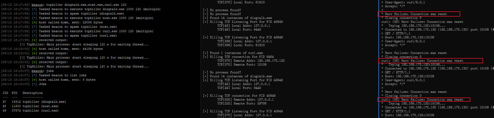

# tcpkiller_rdi

A reflective dll injection sample for killing tcp connections on post-exploition. This is an enhanced version for my another project: [tcpkiller](https://github.com/NickYan7/tcpkiller) (_bof version_). The security detection rules of some modern EDRs rely on cloud-based virus databases to sample and analyze processes. If their network connections are paralyzed, we can evade detection by anti-virus software to a certain extent.  

The BOF is not designed for long-term task, it will block the original beacon process while the `tcpkiller` is running, and I solved this by `Reflective DLL Injection` technique, which spawns a Reflective DLL as a Beacon post-exploitation job, it will 
not affect your main beacon process.  

Most of the code for this project was written by claude-opus-4, and I'm willing to admit that it's much better than GPT-4.  

## usage

1. Load the aggressor script `tcpkiller.cna` in cobaltstrike.  
2. Execute command on beacon.  

```
// This will terminate all TCP connections to ncat.exe in 2 minutes and check every second
beacon > tcpkiller ncat.exe 120

// This will terminate all TCP connections to ncat.exe indefinitely and check every second
beacon > tcpkiller ncat.exe 0

// Multi-process assignment
beacon > tcpkiller dingtalk.exe,ncat.exe,curl.exe 120
beacon > tcpkiller "dingtalk.exe, ncat.exe, curl.exe" 120

// 3 tasks will be assigned as post-exploitation jobs
beacon > jobs
[08/13 18:16:04] [*] Tasked beacon to list jobs
[08/13 18:16:04] [+] host called home, sent: 8 bytes
[08/13 18:16:04] [*] Jobs

 JID  PID   Description
 ---  ---   -----------
 44   20412 tcpkiller (dingtalk.exe)
 45   28756 tcpkiller (ncat.exe)
 46   44216 tcpkiller (curl.exe)

// You can kill these jobs by powerpick (recommend!)
beacon > powerpick ps -id 20412,28756,44216 | kill -fo
```



The default `tcpkiller.x64.dll` is set to debug mode, and all debug output is written to `C:\Windows\Temp\reflective_debug.log`, you can turn it off in `dllmain.cpp`.  

## build

Visual Studio 2019 && Remember to set the `PreprocessorDefinitions` configuration, check this in _project_.vcxproj.  

__NOTE: I'VE ONLY TESTED ON x64 MACHINE, USE IT AS YOUR OWN RISK.__

## acknowledegement

> https://github.com/kyxiaxiang/TcpNsiKill  
> https://github.com/crisprss/BypassUserAdd  
> https://github.com/stephenfewer/ReflectiveDLLInjection  

## disclaimer

This tool is intended only for legally authorized enterprise security development. If you wish to test the tool's usability, please set up your own target environment.  

To prevent malicious use, all proof-of-concept (PoC) tests included in this project are theoretical and do not contain vulnerability exploitation procedures. No real attacks or exploits will be conducted against the target.  

When using this tool for testing, you must ensure that your actions comply with local laws and regulations and that you have obtained sufficient authorization. Do not scan unauthorized targets.  

If you engage in any illegal activities while using this tool, you will bear the consequences and we will not assume any legal or consequential liability.  

Before installing and using this tool, please carefully read and fully understand all terms and conditions. Restrictions, disclaimers, or other clauses that affect your rights may be highlighted in bold or underlined for your attention. Do not install or use this tool unless you have fully read, understood, and accepted all terms and conditions. Your use of this tool, or any other explicit or implicit indication of your acceptance of this Agreement, constitutes your reading and agreement to the terms and conditions.  
